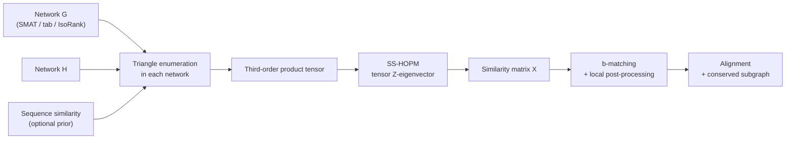

# TAME: Triangular AlignMEnt

**Higher-order global network alignment driven by conserved triangles.**

Classical global network alignment maximises the number of conserved *edges*
together with the sequence similarity of the aligned nodes. TAME raises the order
of the objective: it aligns two networks so as to maximise the number of conserved
*triangles*, the smallest structure that captures the local wiring context of a
node rather than a single contact.

The resulting integer program is NP-hard, so TAME optimises a closely related
surrogate whose stationary points are the Z-eigenvectors of a third-order tensor
built from the two networks. That tensor eigenproblem is solved with a shifted
symmetric higher-order power method (SS-HOPM), and the resulting similarity scores
are rounded into a one-to-one mapping by b-matching.

On the NAPAbench benchmark TAME recovers mappings with high node correctness, and
on the yeast and human BioGRID interactomes it conserves more triangles than the
edge-based state of the art. The paper also reports that the number of conserved
triangles correlates more strongly than the number of conserved edges with both
node correctness and the co-expression of aligned edges, which is the reason to
optimise for them in the first place.

## Pipeline



## Requirements

| Dependency | Notes |
| --- | --- |
| C++17 compiler | GCC 7+ or Clang 6+, with OpenMP |
| [Armadillo](https://arma.sourceforge.net/) | 6.0 or newer |
| BLAS and LAPACK | Any implementation; OpenBLAS or MKL recommended |
| GNU Make | |

Install the dependencies:

```bash
# Debian / Ubuntu
sudo apt-get install build-essential libarmadillo-dev libopenblas-dev liblapack-dev

# Fedora / RHEL
sudo dnf install gcc-c++ armadillo-devel openblas-devel lapack-devel

# macOS (Homebrew)
brew install armadillo libomp
```

> Earlier releases of TAME vendored a copy of Armadillo 5.200 together with one
> developer's CMake build tree. That copy has been removed; TAME now links against
> whatever Armadillo your system provides.

## Build

```bash
git clone https://github.com/shmohammadi86/TAME.git
cd TAME
make
```

This produces the `tri-match` executable. Verify it:

```bash
make check              # small synthetic pair, finishes in seconds\nmake check-badinput     # asserts a headerless similarity file is rejected
```

Install it somewhere on your `PATH`:

```bash
sudo make install                  # /usr/local/bin
make install PREFIX=$HOME/.local   # or your own prefix
```

## Usage

```
tri-match -G <1st_net> -H <2nd_net> [options]

  -t, --type      <tab|isorank|smat>       input file format (default: tab)
  -G, --first     <path>                   first network
  -H, --second    <path>                   second network
  -S, --seq       <path>                   sequence-similarity prior (optional)
  -o, --output    <dir>                    output folder (default: output/)

  -x, --x0        <uniform|random|seqsim>  initialisation (default: uniform)
  -Y, --sparsity  <0|1|2>                  0 = dense, 2 = sparsest
  -i, --iter      <n>                      SS-HOPM iterations (default: 100)
  -a, --alpha     <w>                      weight of sequence similarity vs triangles
  -b, --beta      <s>                      SS-HOPM shift
  -e, --epsilon   <eps>                    convergence threshold (default: 1e-16)

  -p, --b_seq     <b>                      b-matching degree, sequence (default: 50)
  -q, --b_topo    <b>                      b-matching degree, topology (default: 200)
  -I, --post_iter <n>                      post-processing iterations (default: 10)
  -C, --continue  <X.txt>                  resume from a stored similarity matrix
  -h, --help                               show this message
```

### Input formats

Pick one with `-t`; the same format is used for the networks and the prior.

**`smat`** (recommended, and the format of the shipped data). A header line
`rows cols nnz`, then one `row col value` triple per line with **zero-based**
indices:

```
5850 5850 79458
15 31 1.000000
```

**`tab`**. One edge per line as two node labels, no header. Labels are matched
across files, so the sequence-similarity file is keyed by the same labels.

**`isorank`**. The `.net` / `.evals` pair used by IsoRank.

### Bundled data

`input/` holds the full BioGRID human and yeast interactomes used in the paper:

| File | Contents |
| --- | --- |
| `BioGRID_full_human_net.smat` | Human interactome, 14,867 proteins, 126,593 interactions |
| `BioGRID_full_yeast_net.smat` | Yeast interactome, 5,850 proteins, 79,458 interactions |
| `BioGRID_full_human-yeast.smat` | BLAST sequence similarity, 14,867 x 5,850, index-keyed |
| `BioGRID_full_yeast-human.smat` | The same matrix transposed |
| `BioGRID_full_human-yeast.evals` | The same similarities keyed by Entrez gene ID, for `-t tab` |

Note that the `.smat` and `.evals` similarity files are not interchangeable: the
first is keyed by matrix index and belongs with `-t smat`, the second by node
label and belongs with `-t tab`.

### Examples

Three ready-to-run scripts:

```bash
./sparse_run.sh          # sparse mode, with the sequence-similarity prior
./dense_run.sh           # dense mode, with the sequence-similarity prior
./dense_run_noPrior.sh   # dense mode, topology only
```

Or directly:

```bash
./tri-match -t smat \
    -G input/BioGRID_full_human_net.smat \
    -H input/BioGRID_full_yeast_net.smat \
    -S input/BioGRID_full_human-yeast.smat \
    -x seqsim -Y 2 -a 0.85 -b 0.1 --iter 3 --post_iter 3 -o output
```

TAME reports the conserved edges, conserved triangles, matched orthologs, and
matching score at every iteration, and writes the similarity matrix, the final
alignment, and the normalised copies of both networks to the output folder.

## Citation

> Mohammadi, S., Gleich, D. F., Kolda, T. G., & Grama, A. (2017).
> **Triangular Alignment (TAME): A Tensor-Based Approach for Higher-Order
> Network Alignment.** *IEEE/ACM Transactions on Computational Biology and
> Bioinformatics*, 14(6), 1446-1458. https://doi.org/10.1109/TCBB.2016.2595583

`CITATION.cff` is included, so GitHub's "Cite this repository" button will
generate BibTeX and APA entries.

## License

MIT; see [LICENSE](LICENSE).

The b-matching implementation under `src/bMatch/` derives from the b-Suitor
algorithm of Khan et al.

## Contributing

Bug reports and pull requests are welcome via
[GitHub issues](https://github.com/shmohammadi86/TAME/issues).
